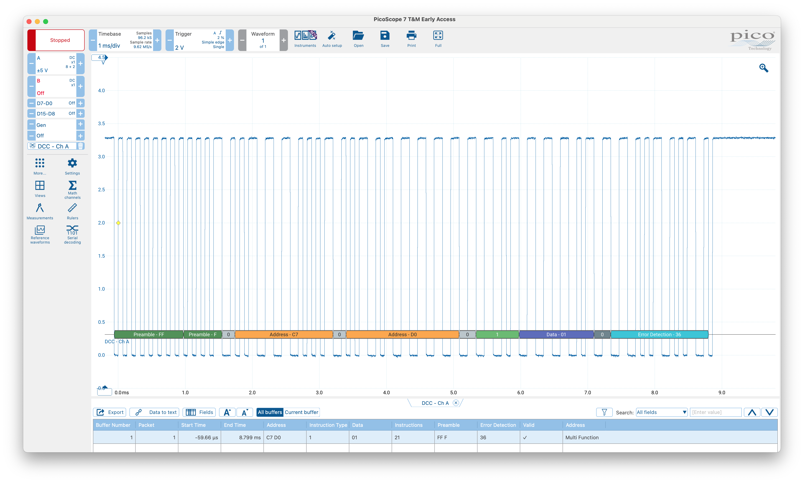

# A simple simulator for dcc signals.

### Example of a 14bit multifunction decoder (extended address mode)
```
{preamble} 0 11AAAAAA AAAAAAAA 0 CCCDDDDD 0 EEEEEEEE 1
A: address bit
C: type bit (see [doc](https://dccwiki.com/Digital_Packet))
D: data bit
E: control bit (xor)
```




### Links
- https://www.nmra.org/index-nmra-standards-and-recommended-practices
- https://www.opendcc.de/elektronik/opendcc/opendcc_sw_lenz.html
- https://dccwiki.com/Digital_packet
- https://dccwiki.com/DCC_Tutorial_(Power)
- http://normen.railcommunity.de/RCN-211.pdf
- https://github.com/mrrwa/NmraDcc/blob/master/NmraDcc.cpp
- https://www.opendcc.de/elektronik/opendecoder/OpenDecoder_V04.zip
- http://www.opendcc.net/elektronik/opendecoder/opendecoder_sw_rm_e.html


### Knowledge
- high: 58us -vcc, 58us +vcc
- low: 116us -vcc, 116us +vcc
