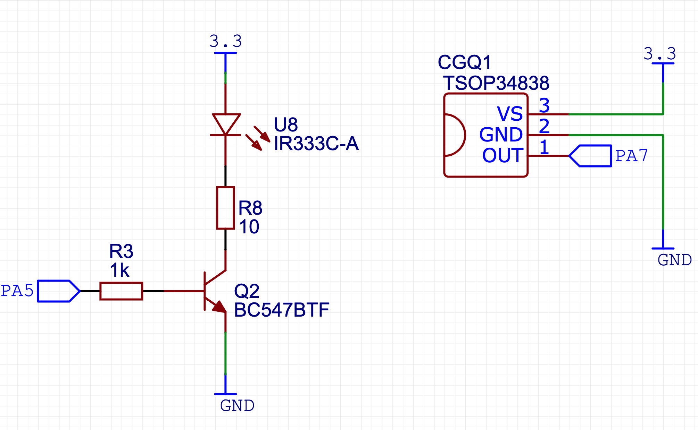
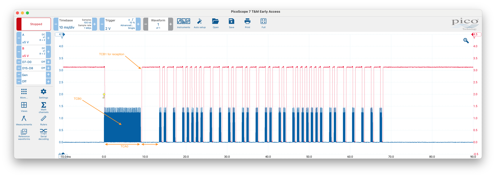
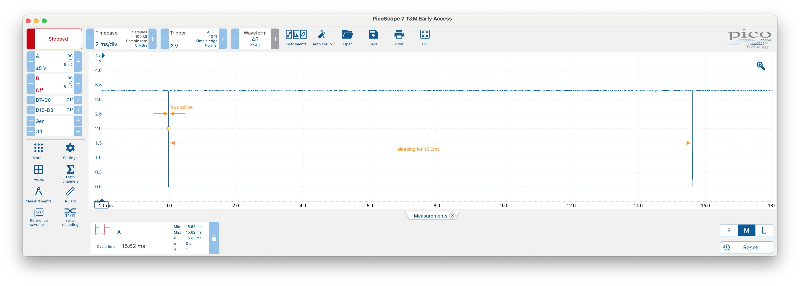

## PURPOSE
This is an example for an infrared transmitter handling [NEC](https://www.sbprojects.net/knowledge/ir/nec.php) signals. The receiver and transmitter work in parallel and do not block each other.

3 buttons attached between PC3-5 and GND can send infrared codes.

The receiver prints the code received on the serial terminal.

## WIRING RECEIVER

## SETUP
We use multiple timers to decode and generate the infrared signal.

### TCB1
This timer captures the infrared signal (it just measures the frequency aka duration of one cycle) on PA7. For this TCB1 is set in "Input Capture Frequency Measurement Mode" (TCB_CNTMODE_FRQ_gc). Every time we get a period, an interrupt is triggered (TCB_CAPT_bm).

We basically check if we got a logic 1 or 0 and store it in a uint32_t variable (cmd_in). As soon as we've got 32 bits, reception is done which we acknowledge with cmd_received = 2.

The input of PA7 is routed as transmitter (event channel) to the input of TCB1 (event user). So nothing to do here, except waiting for cmd_received :-).

The longest cycle we will face in the NEC is the preamble with 13.5ms (9ms + 4.5ms). To avoid an overflow we set use the CLKDIV2 on the clock and run the mcu on 5MHz. With this we can measure a max of 2^16/5000000/2 = 65.536ms. With 10MHz we would only get 13.1ms, which is just not enough.

### TCB0
This timer is used to generate the 38kHz signal for the infrared transmitter. To spare power we use a duty cycle of 1/4.

THe signal is done without interrupt in the game, by make use of the "8-Bit PWM Mode".

### TCA0
This timer is used to generate the logic 1 and 0 of the infrared transmission signal. We define the timer to generate 562us chunks (the smallest duration needed) by setting TCA0.SINGLE.PER = 2810 (2810/5MHz = 562us).

The timer is responsible to start and stop TCB0. In the ISR we go trough the different states until all bits of uint32_t cmd_out are sent.

### RTC
We use the RTC for sleep, timeouts of repeat signals while receiving infrared and to debounce the buttons. To spare power we use a cycle of 512 (RTC.PER = 511, 512/32768 = 15.6ms). This is also fast enough to debounce the buttons

### PIN INTERRUPTS
To detect button pressed we use pin interrupts by setting up the pins with internal pullups and triggering the interrupt on falling edges.

## POWER CONSUMPTION
The element using the most power is the infrared receiver TSOP34838 with 340uA. The mcu is mostly in sleep mode when nothing happens. Of 15.6ms (which is one RTC cylce 512/32768=15.6ms) it's powered for 9us to update our rtc counter and going through the main loop.

The mcu stays active as long as infrared transmission is active.

