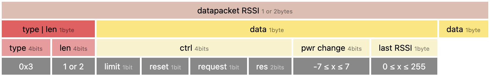

# About
This example is about a node transferring data via a RFM69 to a [gateway](https://github.com/2ni/rfm69-gateway). The format of the packets are described below. They're flexible and can vary for each node (type). On the gateway a rule should be defined accordingly (by node or node type) to understand the data received.

## Packet format

## datapacket types
A datapacket consist of a type/len byte followed by len  data bytes. The 1st byte defines what kind of packet it is (4bits) and how long it is (4bits).

A node can therefore send and receive 16 different types of datapackets each, which can be up to 16 bytes long. Types 0-7 are reserved for generic types, 8-15 are node dependent.

### download types (node -> gateway)
| type | name     | length  | description                                          |
| ---- | -----    | ------  | -----------                                          |
| 0x00 | debug    | 1       | used to debug, eg as counter                         |
| 0x01 | vcc      | 2       | voltage of power source, 522 = 5.22v                 |
| 0x02 | temp     | 2       | temperature on pcb, p.475 in datasheet               |
| 0x03 | rssi     | 1 or  2 | RSSI ctrl, [ last received RSSI as uint8_t ]         |
| ...  |          |         |                                                      |
| 0x08 | humidtiy | 4       | returns humidity (2 bytes) and temperature (2 bytes) |

### upload types (gateway -> node, ie returned with ack)
| type | name      | length | description                                          |
| -    | -         | -      | -                                                    |
| 0x00 | debug     | 1      | used to debug, eg as counter                         |
| 0x01 | timestamp | 4      | current timestamp                                    |
| 0x02 |           |        |                                                      |
| 0x03 | rssi      | 1 or 2 | RSSI ctrl, [ last received RSSI as uint8_t ]         |

### RSSI ctrl
The RSSI ctrl byte gives information about power transmission:
- the lower 4 bits define the amount of change to the power transmission
-  ctrl byte

| bit | mask | description                                                                    |
| -   | -    | -                                                                              |
| 7   | 0x80 | set if node reached a limit (0 or 23) so the gateway doesn't send more changes |
| 6   | 0x40 | set to request a reset of the atc, eg on startup of the node                   |
| 5   | 0x20 | set to request the last rssi value. Should be sent with the next transmission  |
| 4   | 0x10 | reserved for future use                                                        |

